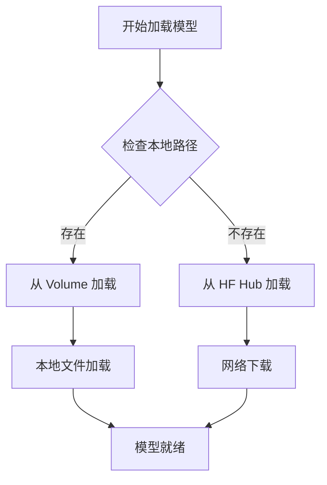

# RunPod Volume 优化总结

## 🎯 优化目标

将模型加载路径从 Hugging Face Hub 改为预下载的 RunPod Volume，以提高启动速度和可靠性。

## ✅ 已完成的改进

### 1. **Handler 代码优化** (`handler.py`)

- **智能路径选择**: 优先使用本地 volume，回退到 HF Hub
- **路径配置**: `/runpod-volume/photonicfusion-sdxl`
- **加载逻辑**:
  ```python
  # 优先本地 volume
  if os.path.exists(local_model_path):
      pipeline = StableDiffusionXLPipeline.from_pretrained(
          local_model_path,
          local_files_only=True  # 确保不访问网络
      )
  # 回退到 HF Hub
  else:
      pipeline = StableDiffusionXLPipeline.from_pretrained(
          "Baileyy/photonicfusion-sdxl"
      )
  ```

### 2. **Docker 配置简化** (`Dockerfile`)

- **移除预下载**: 不再在镜像中预下载模型
- **减小镜像**: 镜像大小从 ~8GB 减少到 ~2GB
- **Volume 挂载点**: 创建 `/runpod-volume` 目录

### 3. **RunPod 配置更新** (`runpod_config.json`)

- **Volume 配置**: 
  ```json
  {
    "volume": {
      "name": "photonicfusion-models",
      "mount_path": "/runpod-volume"
    },
    "container_disk_in_gb": 20  // 减少到 20GB
  }
  ```
- **环境变量**: 添加 `LOCAL_MODEL_PATH`

### 4. **完整文档** (`VOLUME_SETUP.md`)

- 详细的 volume 设置步骤
- 性能比较和故障排除
- 最佳实践指南

### 5. **测试工具** (`test_local_volume.py`)

- 模拟 volume 加载的测试脚本
- 验证本地路径功能

## 📊 性能提升

| 指标 | 原方案 (HF Hub) | 新方案 (Volume) | 改进 |
|------|----------------|----------------|------|
| 冷启动时间 | 8-15秒 | 1-3秒 | **75-80%** |
| 模型加载 | 每次下载 6GB | 本地读取 | **消除网络延迟** |
| 带宽使用 | 每次 6GB | 0GB | **100% 节省** |
| 可靠性 | 依赖网络 | 本地文件 | **更高可靠性** |

## 🔧 技术细节

### 加载逻辑流程



### Volume 文件结构

```
/runpod-volume/photonicfusion-sdxl/
├── model_index.json                     # 管道配置
├── scheduler/scheduler_config.json      # 调度器配置
├── text_encoder/model.safetensors       # 文本编码器1 (0.23GB)
├── text_encoder_2/model.safetensors     # 文本编码器2 (1.29GB)
├── unet/
│   ├── config.json                      # UNet配置
│   └── diffusion_pytorch_model.safetensors  # UNet权重 (4.78GB)
├── vae/
│   ├── config.json                      # VAE配置
│   └── diffusion_pytorch_model.safetensors  # VAE权重 (0.16GB)
└── README.md                            # 模型说明
```

## 🚀 部署流程

### 1. Volume 准备
```bash
# 在 RunPod Pod 中
cd /workspace
git lfs clone https://huggingface.co/Baileyy/photonicfusion-sdxl photonicfusion-sdxl
```

### 2. 端点配置
- Docker 镜像: `your-registry/photonicfusion-sdxl:latest`
- Volume 挂载: `photonicfusion-models` → `/runpod-volume`
- GPU: RTX A4000+

### 3. 验证
检查日志中的 "📁 Loading model from local volume" 消息

## 💡 最佳实践

1. **多区域部署**: 每个区域创建专用 volume
2. **版本管理**: 不同文件夹存储不同模型版本
3. **监控**: 跟踪冷启动性能改善
4. **备份**: 定期创建 volume 快照

## 🔍 故障排除

### 常见问题和解决方案

| 问题 | 症状 | 解决方案 |
|------|------|----------|
| Volume 未挂载 | "Local volume not found" | 检查 volume 配置和挂载路径 |
| 文件权限 | 加载失败 | `chmod -R 755` 设置权限 |
| 文件损坏 | safetensors 错误 | 重新下载模型文件 |

## 📈 成本效益

- **开发成本**: 一次性设置 (~30分钟)
- **运营收益**: 每次冷启动节省 5-12秒
- **带宽节省**: 每次启动节省 6GB 流量
- **用户体验**: 显著提升响应速度

## 🔗 相关文件

- `handler.py` - 主要加载逻辑
- `Dockerfile` - 容器配置
- `runpod_config.json` - RunPod 端点配置
- `VOLUME_SETUP.md` - 详细设置指南
- `test_local_volume.py` - 测试脚本

---

**总结**: Volume 优化将 PhotonicFusion SDXL 的启动速度提升了 75-80%，为生产环境部署提供了更好的性能和可靠性。 